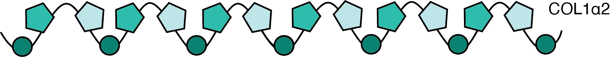

<h2>ZooMS</h2>

Zooarchaeology by mass spectrometry, or ZooMS, is a powerful application of collagen peptide mass fingerprinting (PMF) first developed at the University of York (Buckley et al. 2009; Collins et al. 2010). Based on the measurement of tryptic collagen peptides using matrix assisted laser desorption/ionization time of flight mass spectrometer (MALDI-TOF), it leverages the high abundance and long-term preservation of collagen proteins in bone and other animal tissues with the analytical power of mass spectrometry in order to provide robust taxonomic identifications using minimally destructive methods. Since 2009, ZooMS has been used for diverse applications in archaeology and and cultural heritage, ecology and conservation, and paleontology. The key features of ZooMS that have led to its rapid expansion are its relatively low analytical cost per sample compared to other biomolecular identification methods and its low sample input requirements for taxonomic identification. This allows for large scale taxonomic investigations that can augment morphological analyses of faunal remains, as well as provide taxonomic clarity for animal remains or products lacking diagnostic features, such as worked bone artifacts and cultural heritage objects.
  

<h2>What can be analyzed with ZooMS?</h2>

  ZooMS can be used on any collagenous animal tissue. Common archaeological remains and cultural heritage objects that contain collagen include bone, cartilage, antler, horn cores (but not horn itself), tooth dentine and cementum, ivory, parchment, leather, bird and reptile eggshells, fish scales, and composite tools or artwork containing sinews, animal glues, or animal binders.

<h2>What is the taxonomic resolution of ZooMS</h2>

  Because ZooMS is based on a single relatively conserved protein, it provides less taxonomic resolution than genomic or other proteomic methods. Nevertheless, its low cost and scalability make it a valuable tool for rapidly assessing large faunal assemblages. ZooMS analysis can typically resolve fish to the level of species or genus; mammals to the level of genus or family; and birds to the level of family or order. Differences in taxonomic resolution are related to differences in the proteins making up the collagen triple helix in these three groups, as well as differing functional constraints on collagen evolution related to body temperature and mechanical stress.

<h2>What are the challenges of ZooMS?</h2>

  While there is an increasing interest in ZooMS, there are also significant barriers with respect to data reporting, standardization, and accessibility that have limited the adoption of the technique by new research groups. First, until now there has been no centralized repository of COL1 markers, MALDI-TOF reference spectra, or curated collagen sequences. We seek to overcome this barrier by curating and openly sharing sequence and spectra data to make ZooMS research more transparent and reproducible. Second, there has been a lack of centralized training resources and methodologies. We seek to overcome this barrier by creating tutorials and encouraging the use of open and transparent laboratory protocols. Finally, despite enormous genomic sequencing efforts, collagen remains poorly characterized for many animal species. To address this, we support research to characterize and publish reference collagen spectra and sequences for diverse animal species. 

<h2>Who are we?</h2>

  We are a diverse group of researchers committed to devloping resources to support the broader ZooMS community. We were founded in 2022 by Kristine Richter and Christina Warinner to provide an open access platform for sharing resources and materials related to ZooMS analysis and training. 

<h2>Want to learn more?</h2>

Buckley M, Collins M, Thomas-Oates J, Wilson JC (2009) <a href="https://doi.org/10.1002/rcm.4316">Species identification by analysis of bone collagen using matrix-assisted laser desorption/ionisation time-of-flight mass spectrometry</a>. Rapid Communications in Mass Spectrometry 23:3843–3854.

Collins M, Buckley M, Grundy HH, Thomas-Oates J, Wilsona J, van Doorna N. (2010). <a href="https://www.spectroscopyeurope.com/system/files/pdf/MS_22_2.pdf">ZooMS: the collagen barcode and fingerprints</a>. Spectroscopy Europe 22(2):6-10. 

Richter KK, Codlin MC, Seabrook M, Warinner C.(2022) <a href="https://www.pnas.org/doi/abs/10.1073/pnas.2109323119">A primer for ZooMS applications in archaeology</a>. Proceedings of the National Academy of Sciences 119(20):e2109323119.

Warinner C, Richter KK, Collins MJ. (2022) <a href="https://pubs.acs.org/doi/full/10.1021/acs.chemrev.1c00703">Paleoproteomics</a>. Chemical Reviews 122(16):13401-46.

<i>For further information, see our more comprehensive <a href="/Publications.md">publications list</a>.</i>
