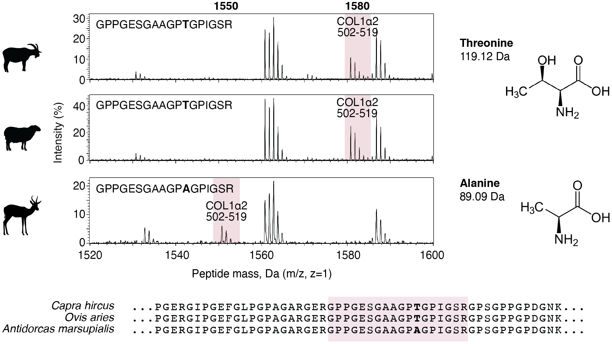

<h2>Welcome to ZooMS!</h2>
This page is for people who are new to ZooMS and would like assistance getting started. Before beginning, there are several primers and reviews available that explain the basic principles of ZooMS. We recommend reading these before proceeding further:

- Richter KK, Codlin MC, Seabrook M, Warinner C. 2022. <a href="https://doi.org/10.1073/pnas.2109323119">A primer for ZooMS applications in archaeology</a>. Proceedings of the National Academy of Sciences 119(20):e2109323119.
- Buckley M. 2018. “<a href="https://doi.org/10.1007/978-3-319-64763-0_12">Zooarchaeology by mass spectrometry (ZooMS) collagen fingerprinting for the species identification of archaeological bone fragments</a>” in Zooarchaeology in Practice: Case Studies in Methodology and Interpretation in Archaeofaunal Analysis, edited by Giovas CM and LeFebvre MJ. Springer International Publishing, pp. 227–247.
- Warinner C, Korzow Richter K, Collins MJ. 2022. <a href="
https://doi.org/10.1021/acs.chemrev.1c00703">Paleoproteomics</a>. Chemical Reviews 122(16):13401-46.
- Kirby DP, Buckley M, Promise E, Trauger SA, Holdcraft TR. 2013. <a href="https://doi.org.10.1039/c3an00925d">Identification of collagen-based materials in cultural heritage</a>. Analyst 138(17):4849-58.

<h2>Collagen</h2>
ZooMS focuses on the peptide mass fingerprinting of type I collagen (COL1), a large triple helical protein found in a wide variety of animal tissues. At the molecular level, COL1 consists of a triple helix made up of three polypeptide α-chains (COL1A). In tetrapods, the triple helix is heterotrimeric, composed of two identical COL1A1 chains and one COL1A2 chain. In teleost fish, it is made up of three different chains (COL1A1, COL1A2, COL1A3), while a small number of species, such as the unicellular hydra, have homotrimeric COL1 composed of three COL1A1 chains. 

<i>Schematic of mammalian collagen illustrating the hierarchical structure of type I collagen. Three COL1a chains twist together to form a triple helix. These then bundle together to form microfibrils, and microfibrils bundle together to form fibrils, and fibrils bundle together to form fibers.</i> 

The amino acid sequence of COL1 is highly structurally and functionally constrained. Each chain consists of a repeating motif of G-X-Y with glycine (G), the smallest amino acid, fitting into the central core of the rotating triple helix. The remaining X and Y amino acid positions are disproportionately made up of proline and hydroxyproline, respectively, the latter being a posttranslational modification (PTM) of proline rarely found outside of collagens. Hydroxyprolines stabilize the triple helix through hydrogen bonding and can be always present (fixed modification) or variably present (variable modification) at a given amino acid position. Amino acids with bulky functional groups are almost entirely absent from COL1 because they disrupt or prevent the formation of the triple helix. 

<i>Rollout image of the first 746 amnino acids encoded by the sheep COL1a2 gene. The signal peptide, which is not present in mature collagen, is marked in red. The repeating G-X-Y motif has been highlighted by indicating each G in green and each P gray. Subsequent posttranslational modifications of some prolines into hydroxyproline are not shown. Image generated in <a href="https://wlab.ethz.ch/protter/start/">Protter</a>.</i>

Because of the functional constraints of COL1, the protein evolves slowly. ZooMS analysis can typically resolve mammals to the level of genus or family; birds to the level of family or order; and fish to the level of species or genus. Differences in taxonomic resolution are related to differences in the proteins making up the collagen triple helix in these three groups, as well as differing functional constraints on collagen evolution related to body temperature and mechanical stress. See <a href="https://doi.org/10.1073/pnas.2109323119">Richter et al. 2022</a> for a more detailed explanation of collagen structure, evolution, and taxonomic resolution.

<i>Alignment of amino acid positions positions 432-824 of the COL1ɑ2 protein from a diverse set of birds, mammals, and fish. Amino acid sequence differences from taxonomic group consensus are marked in black, and marker peptides are shown in pink. Fish have the highest sequence variation, followed by mammals, and then birds. Sequences were aligned using Geneious 2019.0.4 (Biomatters Ltd.).</i>

<h2>Marker peptides</h2>
Within many collagenous tissues, such as bone, COL1 is the most abundant protein present. ZooMS extraction protocols are optimized to preferentially recover collagen over other proteins, resulting in an extraction product that is overwhelmingly COL1. Prior to analysis by MALDI-TOF mass spectrometry, the collagen is digested with an enzyme, typically trypsin, that cuts the protein at predictable locations to produce smaller peptides. Amino acid sequence differences between taxa result in peptides of different mass that are observed as peaks with different m/z. Using a reference database, it is possible to associate these peaks with specific sequences, thereby allowing taxonomic identification. Peptides that are known to produce good discrimination between taxa are called marker peptides. Prior to becoming marker peptides, candidate peptides are first validated using LC-MS/MS to confirm their amino acid sequence. There are currently 9 mammalian marker peptides in widespread use: COL1A1 508-519, COL1A1 586-618, COL1A2 292-309, COL1A2 454-483, COL1A2 484-498, COL1A2 502-519, COL1A2 757-789, COL1A2 793-816, COL1A 978-990.    

<i>Above is an example of how domestic sheep (Ovis aries) and goats (Capra hircus)can be distinguished from wild springbok (Antidorcas marsupialis) using the COL1A2 502-519 marker peptide. Springbok has a threonine (T) where sheep and goat have an alanine (A), resulting in the springbok COL1A2 502-519 marker peptide having a 30 Da lower m/z.  </i>

<h2>Nomenclature</h2>
Several different systems of nomenclature have been used to refer to specific collagen peptides in the ZooMS literature. This can be confusing for beginners. These include systems based on letters (<a href="https://doi.org/10.1002/rcm.4316">Buckley et al. 2009</a>; <a href="https://doi.org/10.1016/j.jas.2013.08.021">Buckley et al. 2014</a>), tryptic position (<a href="https://doi.org/10.1016/j.jas.2020.105116">Richter et al. 2020</a>), and peptide amino acid position (<a href="https://doi.org/10.1016/j.jprot.2020.104041">Brown et al. 2021</a>). We recommend using the system of nomenclature based on peptide amino acid position because it can be applied consistenly and systematically across animal taxa. For further information about changes in nomenclature through time and for advice on interconverting between systems, see <a href="https://doi.org/10.1016/j.jprot.2020.104041">Brown et al. 2021</a>.
